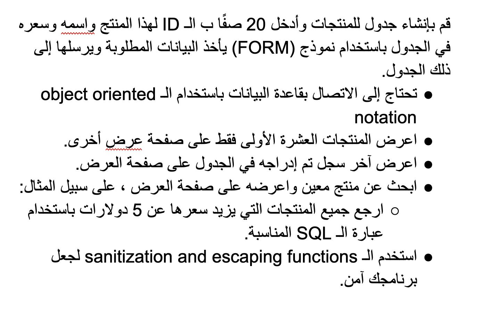

# Instructions  

> __please watch this video to know how to run mysql on replit__ -> [click here](https://drive.google.com/file/d/1L8-SLcce3ah7zCAwEMCjNq0nRGaoEqDj/view?usp=sharing)

Create a table of products and insert 20 rows with the Id of that product, the name and the price of it into the table using a form that takes the needed data and submits it into that table.

- Connect to database using object oriented notation.
- Display only the first 10 products on another display page.
- Display the last record inserted to the table on the display page.
- Search about a specific product and display it on the display page, for example:
  - return all products that have a price more than 5$ using the suitable query statement.
- Use sanitization and escaping functions to secure your program.

# Instructions  

# DB SCHEMA

### The product table schema (feel free to add more columns)

| Column      | Description |
| ----------- | ----------- |
| id      | INT       |
| name   | VARCHAR        |
| price   | FLOAT or DOUBLE        |
| description   | TEXT        |
| quantity   | INT        |
| created_at   | date        |
